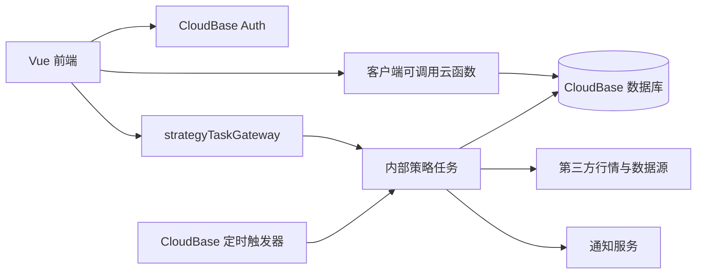

# 何以有数

何以有数是一个基于 Vue 3、TypeScript 和腾讯云开发（CloudBase）的金融数据可视化应用。项目提供市场观察、投资策略跟踪、组合分析、投资账本、通知订阅和后台管理等能力。

> 本项目展示的行情、策略和统计结果仅用于数据研究与工具演示，不构成投资建议。第三方行情可能存在延迟、缺失或口径差异，生产使用前应核对数据来源和更新时间。

## 主要功能

### 市场与策略

- 首页看板：市场数据、策略盘中快照和策略观察汇总。
- 全天候策略：多资产配置、净值、回撤、月度收益和资产权重。
- 可转债策略：策略净值、持仓轮动、收益和风险指标。
- 转债全景：价格分层、市场广度、估值位置和成交热度。
- 微盘股策略：策略历史、最近状态、持仓和调仓辅助。
- 动量策略：资产轮动、阶段收益和最近策略状态。
- 含权策略：正股配债相关策略、候选标的和调仓记录。
- LOF 溢价监控：折溢价、成交额、申购状态和通知条件。

### 组合与个人工具

- 组合实验室：多策略权重组合、收益、波动、回撤、相关性和蒙特卡洛分析。
- 投资账本：账户、策略、资金流和期末金额记录，以及组合分析和导出。
- 投资工具：组合再平衡、复利和 FIRE 资产消耗模拟；独立的定投计算器目前仍为“敬请期待”。
- 财富版图：基于 Mapbox 的资产目标与进度可视化。
- 通知设置：支持 Bark 和企业微信渠道以及策略订阅。

### 账户与管理

- CloudBase 手机号密码登录、短信验证码找回密码；注册代码仍保留，但当前界面暂停新用户注册。
- 登录态同步、过期处理和 capability 路由权限。
- 会员状态、支付状态查询和用户持仓同步。
- 管理中心：会员管理、通知配置、数据源 Cookie 和策略任务刷新。

## 页面与权限

项目使用 Hash 路由。除登录、权限异常和 404 页面外，业务页面均要求登录。

| 路径 | 页面 | capability |
| --- | --- | --- |
| `/home` | 首页 | `app:read` |
| `/all-weather` | 全天候策略 | `app:read` |
| `/bonds` | 可转债策略 | `app:read` |
| `/bond-market` | 转债全景 | `app:read` |
| `/micro-cap` | 微盘股策略 | `app:read` |
| `/momentum` | 动量策略 | `app:read` |
| `/rights-strategy` | 含权策略 | `app:read` |
| `/lof` | LOF 溢价监控 | `app:read` |
| `/portfolio-analysis` | 组合实验室 | `app:read` |
| `/investment-ledger` | 投资账本 | `app:read` |
| `/tools` | 投资工具 | `app:read` |
| `/wealth-map` | 财富版图 | `app:read` |
| `/about` | 关于本站 | `app:read` |
| `/admin` | 管理中心 | `admin:manage` |

路由 capability 只负责前端导航和展示。云函数必须重新验证登录态、管理员身份、会员权益和资源归属，不能把前端路由守卫当作服务端权限边界。

## 技术栈

- Vue 3 + Composition API + `<script setup>`
- TypeScript
- Vite 5
- Vue Router（Hash 模式）
- Pinia
- Element Plus
- ECharts / vue-echarts
- Mapbox GL
- Axios
- 腾讯云开发 Web SDK 和 Node SDK
- CloudBase 云函数、云数据库、身份认证和静态托管

## 系统架构



前端通过 `src/services/cloudFunction.ts` 统一处理云函数调用和登录过期。策略读取与管理员刷新逐步通过 `strategyTaskGateway` 收口，定时任务和内部写函数由 `cloudbaserc.json` 配置触发。

## 仓库边界

当前 Git 仓库主要跟踪前端、根构建配置和 `cloudbaserc.json`，`.gitignore` 会排除整个 `functions/` 和 `.codex-cloud-functions/`：

- 全新 clone 不包含云函数源码，也无法只依靠 `cloudbaserc.json` 部署后端。
- 需要后端开发、测试或部署时，应从团队授权的独立交付渠道取得与当前环境匹配的 `functions/`。
- `.codex-cloud-functions/` 是本地旧副本，不是源码或部署配置的权威来源。
- 云函数源码可能接触敏感配置，但忽略目录不能替代 Secret 管理和正式版本控制。

## 环境要求

- Windows 10/11、macOS 或 Linux
- Node.js 20 或更高版本
  - 本地前端已可在 Node.js 24 环境构建。
  - 云函数实际 runtime 以 `cloudbaserc.json` 为准。
- npm
- Chrome、Edge、Firefox 或 Safari 的现代版本
- 需要部署或维护云资源时，准备 CloudBase 环境和 CLI 登录权限

## 本地开发

```bash
# 安装依赖
npm install

# 启动开发服务器，默认端口 5173
npm run dev

# 生产构建
npm run build
```

开发服务器监听 `0.0.0.0:5173`。路由使用 Hash 模式，因此本地和静态托管通常不需要额外的 History fallback 配置。

### 代码质量命令

```bash
# ESLint：当前脚本会直接修复文件
npm run lint

# Stylelint：当前脚本会直接修复文件
npm run lint:style

# Prettier：当前脚本会重写匹配文件
npm run format

# 删除依赖、重新安装并启动 Vite
npm run reset
```

运行这些命令前请先检查工作树。当前 `lint`、`lint:style` 和 `format` 都不是只读检查命令。

## 测试

项目目前使用 Node.js 内置的 `node:test` 测试后端纯逻辑和关键权限响应。以下命令仅适用于已经取得本地 `functions/` 源码的工作区。

```bash
node --test functions/strategy-response.test.js functions/getBondMarketData/bond-market-core.test.js functions/getHomeDashboardData/strategyObservation.test.js functions/renewMembership/index.test.js
```

根目录暂时没有 `npm test` 和可通过的 TypeScript 门禁。`npm run build` 成功只代表 Vite 可以产出前端文件，不代表完整类型检查已经通过。

## 环境配置

### 前端环境变量

前端环境文件：

- `.env.development`：本地开发代理和公共路径。
- `.env.production`：生产 API 地址、公共路径、console 删除和运行时导出项。

主要变量：

```dotenv
VITE_PUBLIC_PATH=/
VITE_DROP_CONSOLE=true
VITE_API_BASE_URL_1=/api
VITE_API_PROXY_URL_1=http://example.internal
VITE_MAPBOX_ACCESS_TOKEN=your-public-mapbox-token
VITE_ATTRS_EXPORT=["VITE_API_BASE_URL_1"]
```

所有 `VITE_*` 变量都可能进入浏览器或构建产物，不能用于保存私钥、Cookie、密码或 API Secret。

`npm run build` 会根据 `VITE_ATTRS_EXPORT` 生成 `dist/_app.config.js`。当前 Vite 配置没有自动把该脚本插入 `index.html`；如果生产代码依赖 `window.__PRODUCTION__SERVICE__CONFIG`，托管层或 HTML 必须明确加载 `/_app.config.js`。

### CloudBase 环境

新环境至少需要同步以下位置：

- `src/lib/cloudbase.ts`：前端 CloudBase 环境初始化。
- `cloudbaserc.json`：云函数环境、runtime、内存、超时和触发器。
- `deploy-frontend.bat`：当前前端部署目标环境。

部分云函数支持以下环境变量：

| 变量 | 用途 |
| --- | --- |
| `LOF_COLLECTION` | LOF 快照集合名 |
| `LOF_CLOSED_DATES` | LOF 额外休市日期 |
| `JISILU_COOKIE` | 集思录服务端 Cookie |
| `ENABLE_EASTMONEY` | 是否启用东方财富数据源 |
| `REFRESH_MS` | LOF 缓存刷新间隔 |
| `FUND_POOL_REFRESH_MS` | LOF 基金池刷新间隔 |
| `XUEQIU_COOKIE_API_KEY` | 雪球 Cookie HTTP 接口鉴权 |
| `RIGHTS_STRATEGY_COLLECTION` | 含权策略快照集合名 |
| `BOND_MARKET_HISTORY_COLLECTION` | 转债历史集合名 |
| `BOND_MARKET_INTRADAY_COLLECTION` | 转债盘中快照集合名 |
| `BOND_MARKET_CLOSED_DATES` | 转债额外休市日期 |

敏感变量应配置在 CloudBase Secret 或云函数环境变量中，不应提交到 Git，也不应使用 `VITE_*` 前缀。

## CloudBase 云函数

取得后端源码后，`functions/` 中每个云函数拥有独立的 `package.json`。根 `cloudbaserc.json` 是已声明函数和定时触发器的部署配置来源；不要与函数目录中的旧 `config.json` 混合作为发布依据。

主要分类：

- 用户与权限：`loginOrRegister`、`getUsers`、`updateAdminUser`、`renewMembership`。
- 策略任务网关：`strategyTaskGateway`。
- 策略读取：`get*StrategyData`、`get*RealtimeInfo`、`getHomeDashboardData`。
- 策略刷新：`update*StrategyRealtime`、`getBondMarketData`、`getLofData`、`getRightsStrategyData`。
- 投资账本：`investmentLedger`。
- 通知：`notification`、`notificationSettings`。
- 数据源配置：`xueqiuCookieConfig`、`jisiluCookieConfig`、`getXueqiuCookie`。
- 支付与会员：`createAlipayOrder`、`checkAlipayStatus`、`renewMembership`。

详细接口说明可继续阅读：

- `functions/investmentLedger/README.md`
- `functions/getXueqiuCookie/README.md`
- 各函数目录内的 `Readme.md` 或 `README.md`

### 函数访问规则

- 浏览器只应调用明确公开的业务入口。
- 定时刷新、内部写入和通知群发函数应在 CloudBase 函数安全规则中禁止客户端直接调用。
- 管理员函数仍需在函数内部查询当前用户并验证 `admin === true`。
- 会员数据仍需在函数内部验证有效期和数据字段权限。
- 不要使用客户端可提交的 `internalCall`、`type` 或 `TriggerName` 作为权限依据。

### 当前部署边界

当前本地函数树中，以下前端依赖函数未进入 `cloudbaserc.json`：

```text
checkAlipayStatus
createAlipayOrder
getBondPortfolio
getMicroCapData10
getPortfolioAnalysisData
updateUserHoldings
```

这些函数不会自动随基于根配置的批量流程部署。发布前必须核对函数目录、根配置、CloudBase 安全规则、数据库索引和线上函数版本。

## 数据与维护脚本

- `data/`：本地研究、回测、种子和生成数据，已从 Git 忽略，不会由 Vite 自动发布。
- `public/static/`：真正需要公开访问的静态资源，例如地图和通知配置指引。
- `scripts/`：策略数据构建、查询、补丁和 CloudBase 数据初始化脚本。

受权限保护的策略原始数据不得放入 `public/`，否则会被 Vite 原样复制到 `dist/` 并公开访问。

维护脚本可能直接读写目标 CloudBase 环境，而且部分脚本会临时下载最新 CloudBase CLI。执行前必须检查脚本中的环境 ID、输入文件和操作类型，生产环境操作应先备份并完成 dry run。

## 前端构建与部署

```bash
npm run build
```

构建结果位于 `dist/`。Windows 环境可以使用：

```bat
deploy-frontend.bat
```

该脚本会重新构建并将 `dist/` 直接部署到配置的 CloudBase 静态托管环境。它当前面向人工执行，包含交互式暂停，不适合作为无人值守 CI。

云函数应按 `cloudbaserc.json` 和团队的 CloudBase 发布流程单独部署。前端托管部署不会自动更新云函数。

## 目录结构

```text
.
├─ build/                    # Vite 代理和构建后运行时配置生成
├─ data/                     # 本地研究/种子数据，不进入前端构建
├─ functions/                # 本地 CloudBase 云函数源码，当前不由此 Git 仓库跟踪
├─ public/                   # 公开静态资源
├─ scripts/                  # 数据构建、查询、补丁和初始化脚本
├─ src/
│  ├─ assets/                # 图片等编译期资源
│  ├─ components/            # 通用组件和加载组件
│  ├─ composables/           # 月度收益、消息等组合式逻辑
│  ├─ hooks/                 # 环境配置 Hook
│  ├─ lib/                   # CloudBase SDK 初始化
│  ├─ router/                # 路由、SEO 和 capability 守卫
│  ├─ services/              # 云函数、认证和账本服务层
│  ├─ store/                 # Pinia 用户状态
│  ├─ style/                 # 全局样式
│  ├─ utils/                 # 指标、SEO 和旧 HTTP 工具
│  └─ views/                 # 业务页面
├─ types/                    # 自动导入和全局类型声明
├─ cloudbaserc.json          # CloudBase 函数与触发器配置
├─ vite.config.mts           # Vite 配置
├─ tsconfig.json             # TypeScript 配置
└─ package.json              # 前端依赖和脚本
```

## 开发约定

### 新增页面

1. 在 `src/views/` 创建页面。
2. 在 `src/router/index.ts` 使用动态导入注册路由。
3. 设置 `requiresAuth`、`capability`、`title` 和 `description`。
4. 通过领域 service 或 `callCloudFunction()` 获取数据。
5. 页面卸载时清理事件监听、定时器和 ECharts/Mapbox 实例。

### 新增云函数

1. 在 `functions/<function-name>/` 创建 `index.js` 和独立 `package.json`。
2. 在服务端验证用户身份、权限、输入边界和资源归属。
3. 如需声明式部署或定时触发，将函数加入 `cloudbaserc.json`。
4. 为纯计算、鉴权和幂等流程补充 `node:test`。
5. 不记录或返回 Cookie、私钥、完整第三方错误和不必要的用户字段。

## 当前已知工程约束

- 根项目尚未提供只读 lint、`npm test` 和可通过的 TypeScript 检查脚本。
- `npm run build` 使用 Windows 风格的环境变量设置，跨平台 CI 需要调整。
- `dist/_app.config.js` 会生成，但当前不会自动注入 HTML。
- `functions/` 和 `.codex-cloud-functions/` 被 Git 忽略，后端需要单独的安全版本控制和交付流程。
- 本地 `functions/` 目录和 `cloudbaserc.json` 声明的函数集合并不完全一致。
- 部分函数目录的旧 `config.json` 与根定时器配置存在漂移，发布时应以根配置和线上核对结果为准。
- 前端仍有若干较大的单文件组件，后续拆分应优先抽纯函数和生命周期逻辑，避免一次性重写业务。

## 浏览器支持

- 推荐使用最新版 Chrome 或 Edge。
- Firefox、Safari 等现代浏览器可用于普通页面，但仓库暂未配置自动化兼容性矩阵。
- 财富版图依赖 WebGL 和有效的 Mapbox Access Token。
- 不支持 Internet Explorer。
